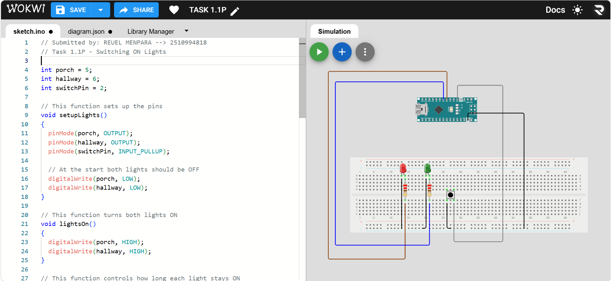

# Submitted by: REUEL MENPARA --> 2510994818
# Task 1.1P - Switching ON Lights

This project uses an Arduino Nano, two LEDs and a push button to control the porch and hallway lights followed by the resistors.

When the button is pressed, both lights turn ON. The porch light stays ON for 30 seconds, while the hallway light stays ON for 60 seconds.

# Note: In the youtube video, I have changes the code and reduced the time to 3 seconds and 6 seconds instead ofg 30 seconds and 60 seconds respectively, to demonstrate in short video.  

## Modular Programming
I used separate functions for different parts of the program:

==> setupLights() sets up the pins and keeps both lights OFF at the start.
==> lightsOn()` turns ON both lights.
==> lightsTimer() controls the 30-second porch and 60-second hallway timing.

This makes the code easier to understand and modify because each function has a specific job.

## Circuit
D2 → Push Button
D5 → Porch LED through 220Ω resistor
D6 → Hallway LED through 220Ω resistor
GND → Common ground

## Result
The system successfully turns ON both lights when the button is presse and switches them OFF after the described time. 

